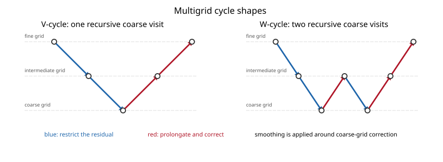
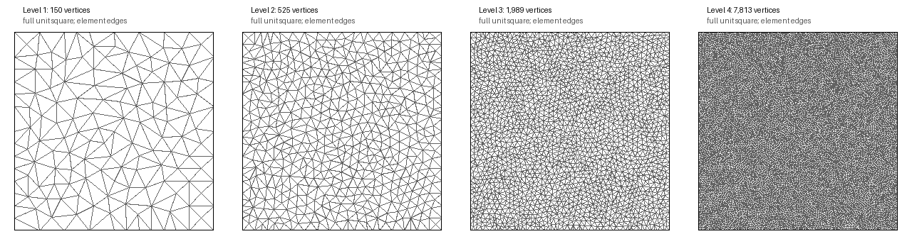
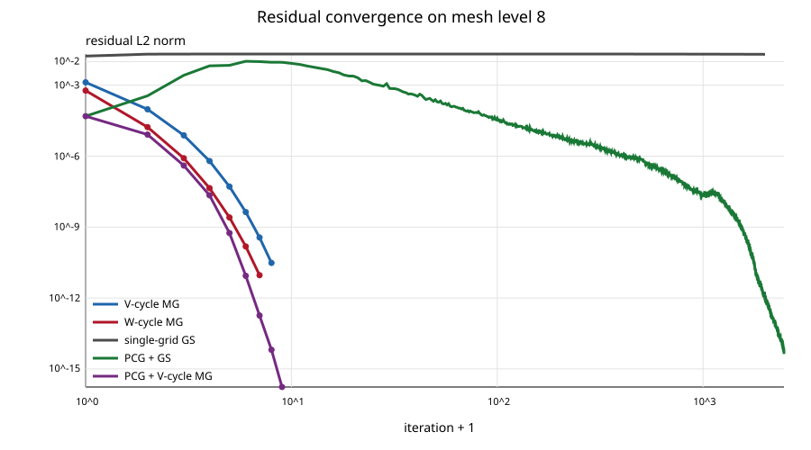
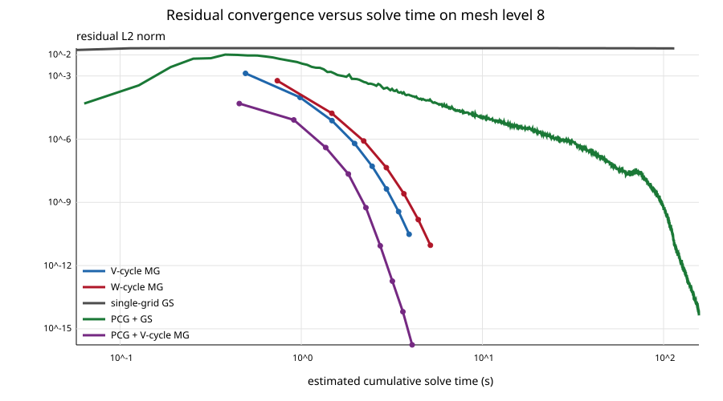
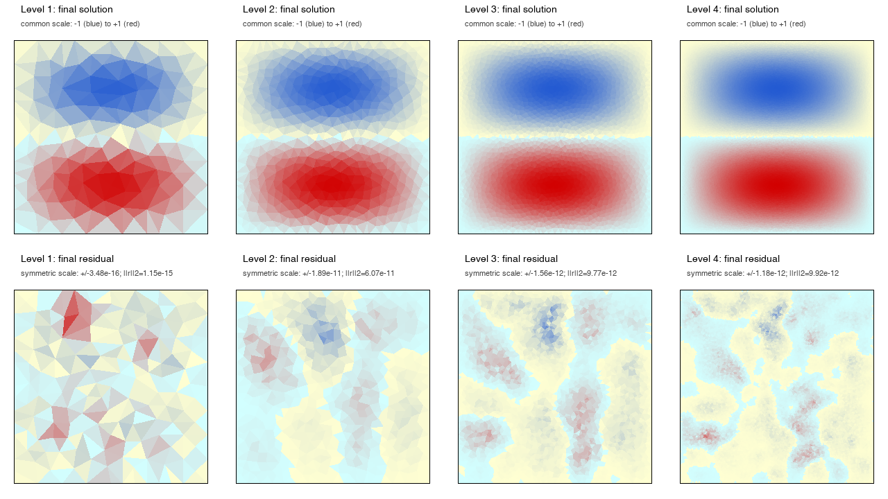
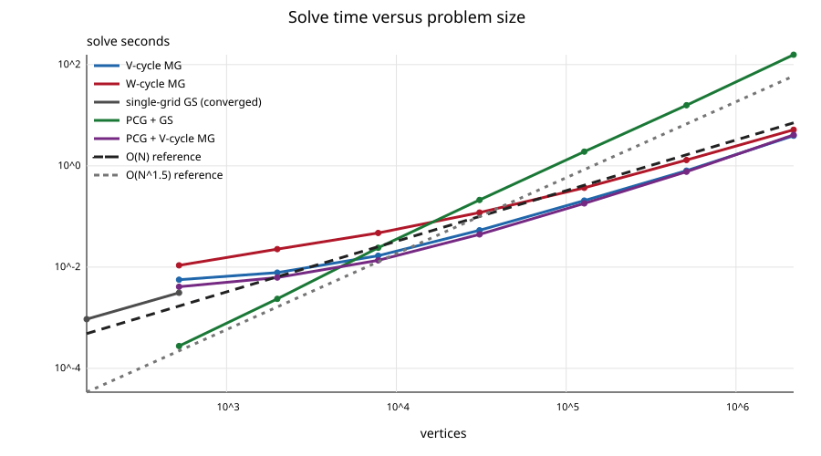
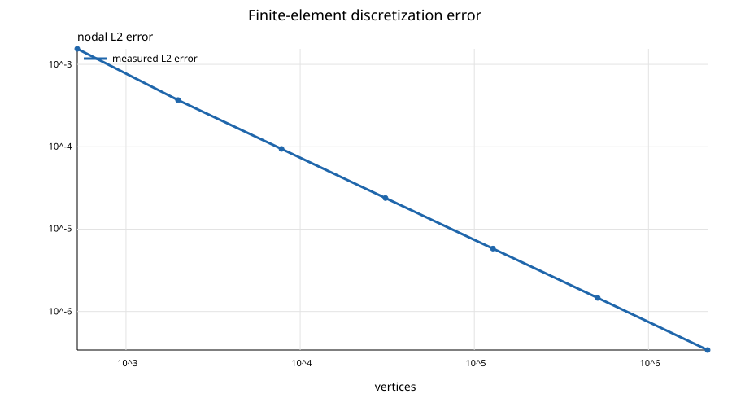

# Multigrid Convergence for a Finite-Element Poisson Problem

This repository implements and benchmarks geometric multigrid for a two-dimensional finite-element Poisson problem on non-nested triangular meshes.

## Contents

- [1. Overview](#1-overview)
- [2. Problem and numerical method](#2-problem-and-numerical-method)
- [3. How multigrid works](#3-how-multigrid-works)
- [4. Mesh sequence](#4-mesh-sequence)
- [5. Results](#5-results)
- [6. Interpretation](#6-interpretation)

## 1. Overview

The experiment compares V-cycle and W-cycle multigrid with single-grid Gauss–Seidel and Preconditioned Conjugate Gradient methods. It measures residual convergence, solve time, scaling with mesh size, and finite-element discretization error.

## 2. Problem and numerical method

The code solves the following equation on the unit square with linear triangular finite elements:

$$
-\nabla \cdot (K \nabla u) = f.
$$

The diffusion tensor is the identity matrix:

$$
K = I.
$$

The manufactured exact solution is:

$$
u(x,y) = \sin(\pi x)\sin(2\pi y).
$$

The source term is chosen so that this function is the exact solution:

$$
f(x,y) = 5\pi^2 \sin(\pi x)\sin(2\pi y).
$$

The code approximates the Dirichlet boundary value $u=g$ with a large-coefficient Robin condition:

$$
\nabla u \cdot n + \beta u = \beta g,
\qquad \beta = 10^{10}.
$$

Here, $n$ is the outward unit normal. Equivalently, the condition is $\nabla u \cdot n + \beta(u-g)=0$. As $\beta \to \infty$, it approaches the Dirichlet condition $u=g$.

The report compares five solvers:

- geometric multigrid (MG) with a V-cycle;
- geometric multigrid with a W-cycle;
- single-grid Gauss–Seidel (GS), with one residual-correction sweep per iteration;
- Preconditioned Conjugate Gradient (PCG) with a GS preconditioner; and
- PCG with one V-cycle as the preconditioner.

Each multigrid cycle uses three pre-smoothing sweeps and three post-smoothing sweeps per level. The coarsest level uses 500 sweeps. Every solver uses the following stopping criterion:

$$
\lVert r \rVert_2 < 10^{-10}.
$$

## 3. How multigrid works

### 3.1. Residual correction

After finite-element discretization, the problem is a linear system:

$$
Ax=b.
$$

For a current approximation $x$, the residual is:

$$
r=b-Ax.
$$

A residual-correction method updates the solution by:

$$
\delta x=A^*r,
$$

$$
x \leftarrow x+\delta x,
$$

where $A^*$ is intended to approximate $A^{-1}$. If $A^*=A^{-1}$, one update gives the exact solution. Useful iterative methods choose an inexpensive $A^*$ that captures enough of the structure of $A$ to reduce the error quickly.

**Richardson iteration:** The simplest choice is $A^*=I$, which adds the residual directly to the current solution. A relaxation factor is often included to control the size of the correction.

**Gauss–Seidel (GS):** Write the matrix as $A=D+L+U$, where $D$, $L$, and $U$ are its diagonal, lower-triangular, and upper-triangular parts. A forward GS correction uses the inexpensive triangular inverse $(D+L)^{-1}$. This code uses symmetric GS, whose correction operator is:

$$
A^*_{\mathrm{SGS}}=(D+U)^{-1}D(D+L)^{-1}.
$$

**Preconditioned Conjugate Gradient (PCG):** PCG applies a preconditioner $M^{-1}\approx A^{-1}$ to the residual, then combines the resulting vectors into mutually $A$-conjugate search directions. This avoids repeatedly undoing progress made in earlier directions. In this report, $M^{-1}$ is either symmetric GS or one multigrid V-cycle.

### 3.2. Two-level multigrid correction

GS quickly reduces error that oscillates from one fine-grid vertex to the next, but it reduces smooth, long-wavelength error very slowly. Multigrid moves that smooth error to a coarse mesh, where it appears more oscillatory and is cheaper to correct.

Starting from the fine-grid residual:

$$
r_h=b_h-A_hx_h,
$$

restriction transfers it to the coarse mesh:

$$
r_H=Rr_h.
$$

The coarse-grid error equation is:

$$
A_He_H=r_H.
$$

Here, this code obtains $A_H$ by rediscretizing the differential equation on the independently generated coarse mesh. The coarse equation is solved approximately—using many GS sweeps at the coarsest level or another multigrid cycle above it. The correction is interpolated back to the fine mesh and added to the solution:

$$
x_h \leftarrow x_h+Pe_H.
$$

The meshes in this experiment are generated independently and are not nested. The prolongation operator $P$ uses barycentric interpolation to transfer a coarse-grid correction to fine-grid vertices. The restriction operator is the transpose of prolongation (the standard variational choice in finite-element multigrid):

$$
R=P^T.
$$

A complete two-level cycle therefore performs fine-grid pre-smoothing, restricts the residual, approximately solves the coarse error equation, prolongates the correction, and finally performs post-smoothing. Restriction is the fine-to-coarse operation $R$; prolongation is the coarse-to-fine operation $P$.

### 3.3. V-cycles and W-cycles

With more than two meshes, the coarse solve is performed recursively. A V-cycle visits each coarser level once before returning to the fine mesh. A W-cycle revisits coarse levels, spending more work on the coarse correction. It can be more robust, but each cycle is more expensive.

## 4. Mesh sequence

The meshes were regenerated with Jonathan Shewchuk's Triangle 1.6 and the original area constraints. Levels 1–8 contain 150, 525, 1,989, 7,813, 30,873, 127,786, 511,082, and 2,184,494 vertices, respectively.

Each panel shows the complete unit square at the same scale. The element edges are read directly from the corresponding `.ele` file. Levels 5–8 are omitted because their elements cannot be distinguished at the report's display resolution. These finer meshes are still included in all numerical results.

## 5. Results

### 5.1. Solver convergence

The table shows how many iterations or multigrid cycles each solver required. A value of 2,000 in the GS column means that Gauss–Seidel reached the iteration limit before satisfying the residual tolerance.

| Level | Vertices | V cycles | W cycles | GS sweeps | PCG+GS | PCG+V |
|---:|---:|---:|---:|---:|---:|---:|
| 2 | 525 | 8 | 8 | 625 | 40 | 6 |
| 3 | 1,989 | 9 | 8 | 2,000 | 77 | 7 |
| 4 | 7,813 | 9 | 7 | 2,000 | 153 | 7 |
| 5 | 30,873 | 9 | 7 | 2,000 | 301 | 7 |
| 6 | 127,786 | 8 | 7 | 2,000 | 623 | 7 |
| 7 | 511,082 | 8 | 7 | 2,000 | 1,188 | 7 |
| 8 | 2,184,494 | 8 | 7 | 2,000 | 2,471 | 8 |

The first plot shows residual reduction as a function of iteration count.

**Level-8 single-grid GS does not achieve any net residual reduction during the measured run.** Its residual starts at $1.708 \times 10^{-2}$ and ends at $2.032 \times 10^{-2}$ after 2,000 sweeps. It rises initially and then decreases too slowly even to recover its starting value.

The next plot relates residual reduction to solve time. The original benchmark recorded total solve time, not a timestamp for each residual sample. The horizontal positions therefore use each method's measured average time per iteration. Setup time is excluded.

### 5.2. Final solution and residual fields

The first row shows the converged finite-element solution on mesh levels 1–4. All four solution plots use the same color scale. The second row shows the final algebraic residual:

$$
r = b - Au.
$$

Residual magnitudes differ between levels, so each residual plot uses its own symmetric color scale. The scale and $\lVert r \rVert_2$ are printed above each plot.

### 5.3. Runtime scaling

This plot compares time to convergence as the number of mesh vertices, $N$, increases. It excludes setup work such as matrix assembly and construction of the inter-grid transfer operators. Single-grid GS is shown only for levels 1 and 2, where it converged. On levels 3–8, it reached the 2,000-sweep limit before satisfying the residual tolerance, so those invalid time-to-convergence points are omitted. The dashed $O(N)$ and $O(N^{3/2})$ lines are slope guides normalized at $N=30{,}873$; they are not fitted timing models.

A log–log fit over the four finest meshes gives exponents of 1.01 for V-cycle MG, 0.89 for W-cycle MG, 1.06 for PCG with V-cycle MG, and 1.55 for PCG with GS. The multigrid methods are therefore close to $O(N)$ over this range, while PCG with GS is close to $O(N^{3/2})$.

### 5.4. Discretization accuracy

This plot shows the nodal $L_2$ error of the V-cycle solution. All converged solvers produce the same discrete solution, so the plot measures finite-element discretization error rather than incomplete solver convergence.

## 6. Interpretation

The V-cycle requires only 8–9 cycles on every mesh from level 2 through level 8. Its iteration count is therefore essentially independent of mesh size. The W-cycle requires 7–8 cycles, but each cycle does more work. On level 8, the W-cycle takes 5.16 s, compared with 3.94 s for the V-cycle.

Single-grid Gauss–Seidel reaches the 2,000-sweep limit on levels 3–8. On level 8, it takes 114.6 s and stops with $\lVert r \rVert_2 = 2.03 \times 10^{-2}$. GS-preconditioned CG converges, but its iteration count grows from 40 on level 2 to 2,471 on level 8. In contrast, V-cycle-preconditioned CG requires only 6–8 iterations.

The regenerated level-8 nodal $L_2$ error is $3.409 \times 10^{-7}$. The archived 2018 value is $3.409150602 \times 10^{-7}$, a difference of about 0.013%. The error decreases by a factor of about four each time the characteristic mesh spacing is halved. This is consistent with the expected $O(h^2)$ convergence of linear finite elements in the nodal error measure used here.

Development and reproduction instructions are in [`DEVELOPMENT.md`](DEVELOPMENT.md), and the important `src/` interfaces are summarized in [`API.md`](API.md). Raw results and per-iteration residuals are retained in `report/generated/results.csv` and `report/generated/history.csv`.
